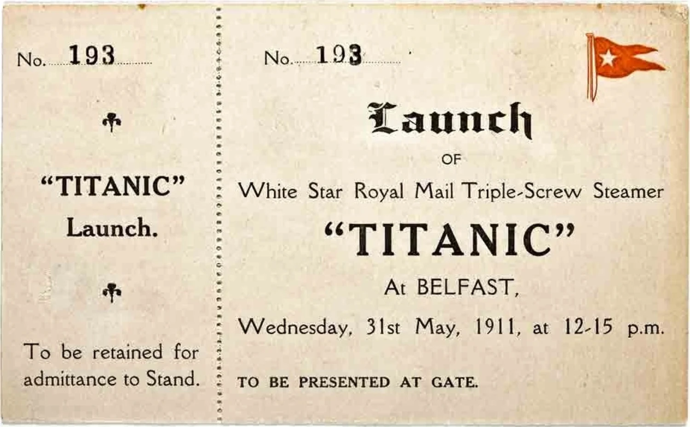
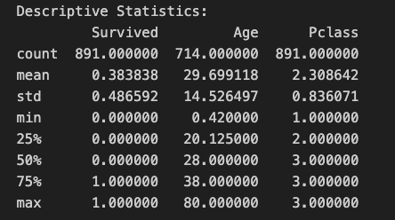
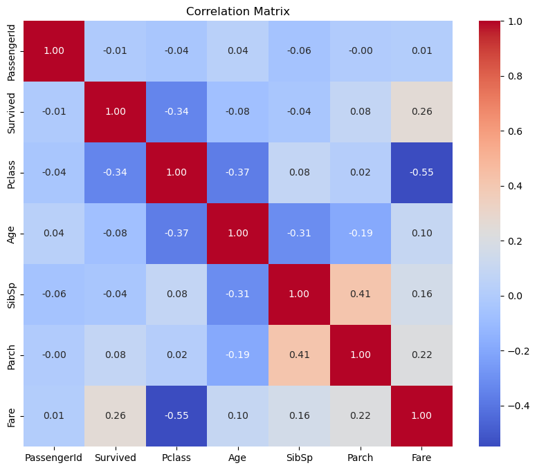
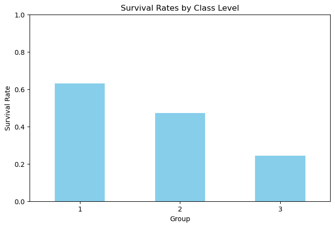
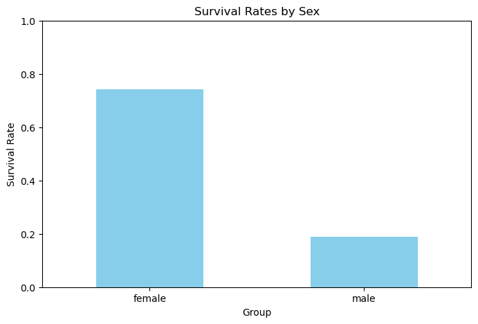

# My Titanic Project 
# IDS 706: Individual Project 1



## IDS 706: Individual Project 1
## Continous Integration using Github Actions of Python Data Science Project
### Eric Ortega Rodriguez

The purpose of this assignment was to create a a python script that utilizes pandas to generate summary statistics.

[](https://github.com/nogibjj/Eric_Ortega_Rodriguez_Individual_Project_-1/actions/workflows/format.yml)

[](https://github.com/nogibjj/Eric_Ortega_Rodriguez_Individual_Project_-1/actions/workflows/install.yml)

[](https://github.com/nogibjj/Eric_Ortega_Rodriguez_Individual_Project_-1/actions/workflows/lint.yml)

[](https://github.com/nogibjj/Eric_Ortega_Rodriguez_Individual_Project_-1/actions/workflows/test.yml)


## YouTube Video
[Click Here For Overview Video](https://youtu.be/1xjDJK5oYKQ)

## Assignment Requirements
* __`Jupyter Notebook`__ with:
  - Cells that perform __descriptive statistics using Polars or Panda__
  - Tested by using __nbval plugin__ for __pytest__
*	__`Python Script`__ performing the same descriptive statistics using Polars or Pandas
* __`lib.py`__ file that shares the common code between the script and notebook
* __`Makefile`__ with the following:
  - Run all tests __(must test notebook and script and lib)__
  - Formats code with __Python Black__
  - Lints code with __Ruff__
  - Installs code via:  __pip install -r requirements.txt__
*	__`test_script.py`__ to test script
*	__`test_lib.py`__ to test library
*	Pinned __`requirements.txt`__
*	__`GitHub Actions`__ performs all four Makefile commands with __badges__ for each one in the `README.md`


## Data Set Used in this Project
The data set used in this project was pulled from github. The Titanic dataset is a well-known dataset in the field of data science and machine learning, often used for educational purposes. It contains information about the passengers aboard the RMS Titanic, which sank on its maiden voyage in April 1912 after hitting an iceberg. The dataset provides valuable insights into the factors that influenced survival rates during this tragic event.

This dataset includes a range of demographic and socio-economic information about the passengers, such as their age, gender, class, and ticket fare. Analysts and data scientists use this dataset to explore various questions.
The data used can be found here: 
https://raw.githubusercontent.com/datasciencedojo/datasets/refs/heads/master/titanic.csv

## Functions

1. ```calculate_correlation_matrix``` -- creates correlation matrix
2. ```survival_rates_by_group``` -- calculates survival rates grouped by column
3. ```glot_survival_rates``` -- plots survival rates
4. ```calculate_descriptive_statistics``` -- calculates and return descriptive statistics

## Data Visualizations
The code provides insights into how various factors (like gender, age, and passenger class) affected survival rates on the Titanic. By visualizing these relationships, it helps the reader understand the demographic influences on survival during the disaster.
## Descriptive Statistics

## Correlation Matrix

## Survival by Class

## Survival by Sex


