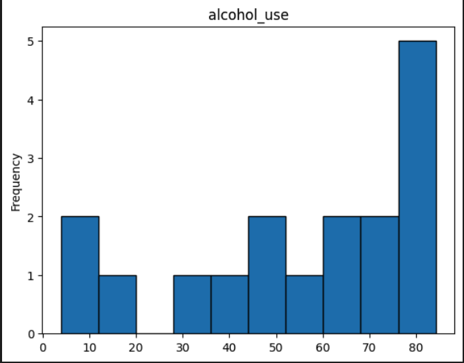

# Eric Ortega Rodriguez's Individual Project #1

## ☑️ Requirements (Individual Project #1):
* ***Jupyter Notebook*** with:
    - Cells that perform descriptive statistics using Polars or Panda.
    - Tested by using nbval plugin for pytest
* ***Makefile*** with the following:
    - Run all tests (must test notebook and script and lib)
    - Formats code with `Python black` Links to an external site.
    - Lints code with `Ruff` Links to an external site.
    - Installs code via: pip install -r requirements.txt
* ***main.py*** to run functions 
* ***test_main.py*** to test script
* ***requirements.txt***
* Gitlab Actions performs all four Makefile commands with badges for each one in the README.md

## ☑️ Deliverables:
1. Cells that perform descriptive statistics using Polars or Panda.
2. Tested by using nbval plugin for pytest
3. Run all tests (must test notebook and script and lib)
4. Formats code with Python black
5. Lints code with Ruff
6. Installs code via:  pip install -r requirements.txt

## ☑️ The Data Being Used
The data being utilized is coming from a GitHub database which can be found [here](https://raw.githubusercontent.com/fivethirtyeight/data/master/drug-use-by-age/drug-use-by-age.csv) 

The data found here give the frequency breakdown of substance abuse among different age groups. 

## ☑️ Analysis and Calculations
Summary statistics included are Mean, Median, Standard Deviation, and Max. 

## ☑️ Explanation and Breakdown of Repo Components: 

[main.py](main.py)

Function: Main entry point of a project containing program. 

[requirements.txt](requirements.txt)

Function: This file lists all the Python dependencies required for the project. It specifies the exact versions of packages needed, making it easy to install all dependencies with a single command. For this project specifically, we will be using pandas and matplotlib. 

[hello.yml](.github/workflows/hello.yml)

Function: This file is typically used for workflows in CI/CD (Continuous Integration/Continuous Deployment) systems, like GitHub Actions. It defines automated processes, such as running tests, building the project, or deploying it when certain events occur.

[Makefile](Makefile)

Function: A Makefile is used to automate tasks in software development, especially compiling and building projects. It contains a set of rules defining how to execute commands for tasks like building, testing, or cleaning up files. This helps streamline repetitive commands.

[test.py](test.py)

Function: test.py is a script typically used to contain test cases for a project and data set. It includes functions or classes designed to verify that the code works as expected. 

## ☑️ Visualization: 
Highlights the frequency of alcohol use among different age groups.

